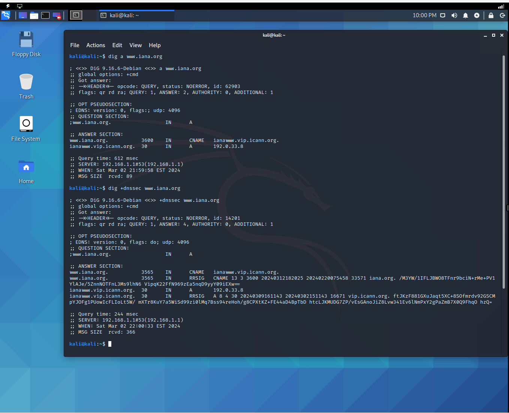
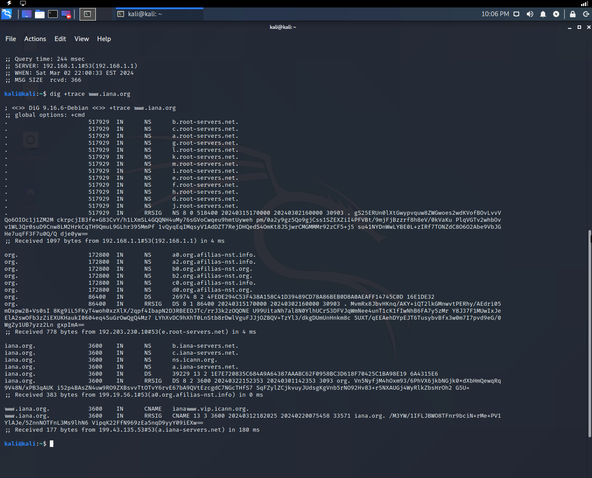
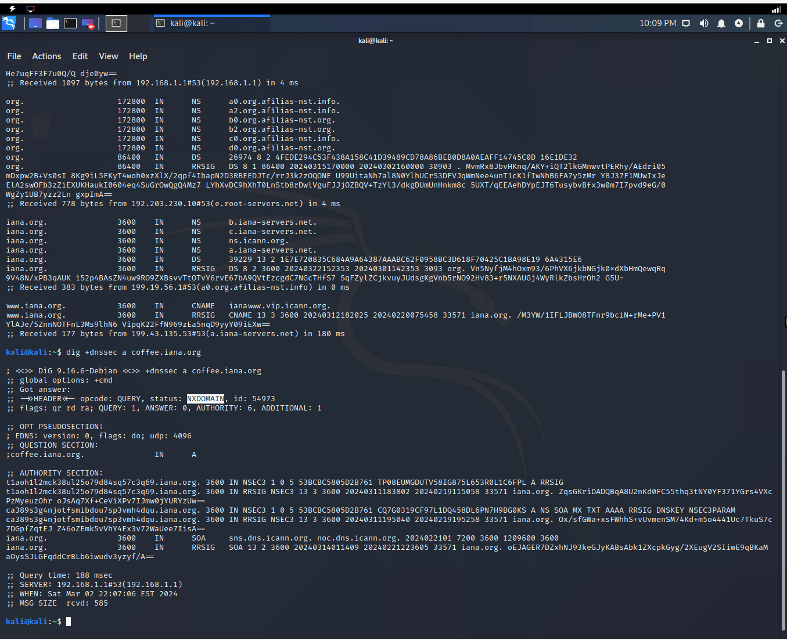
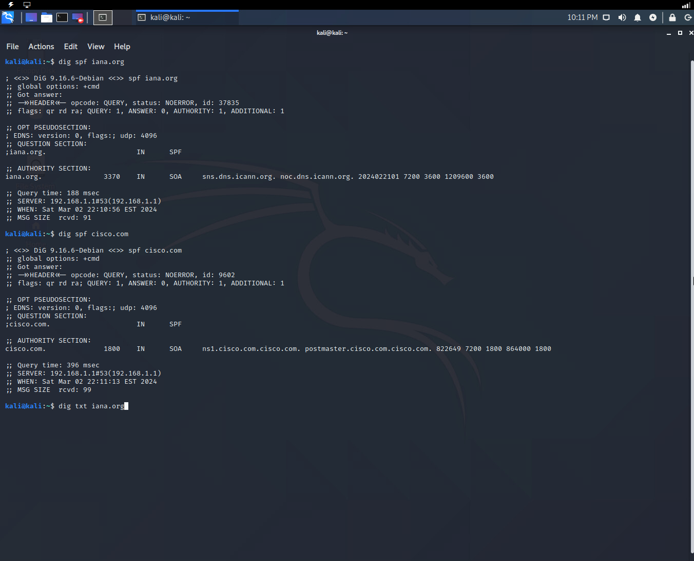
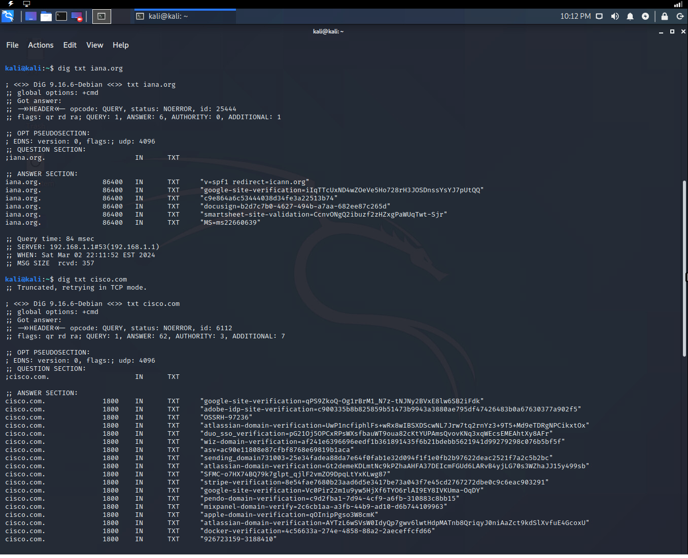
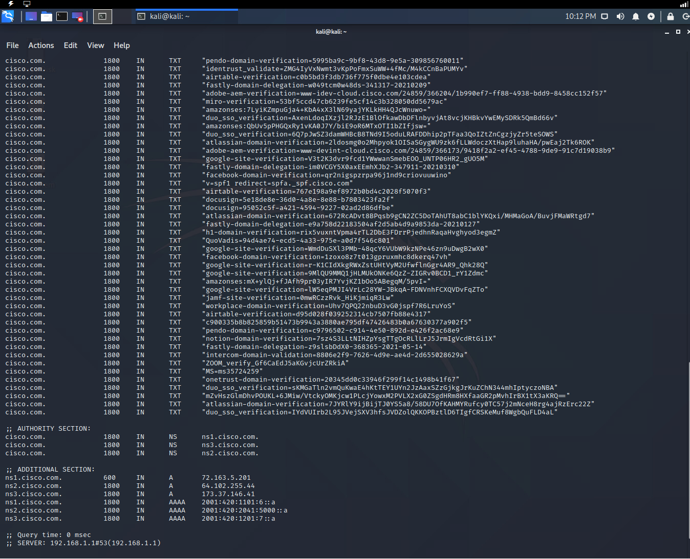
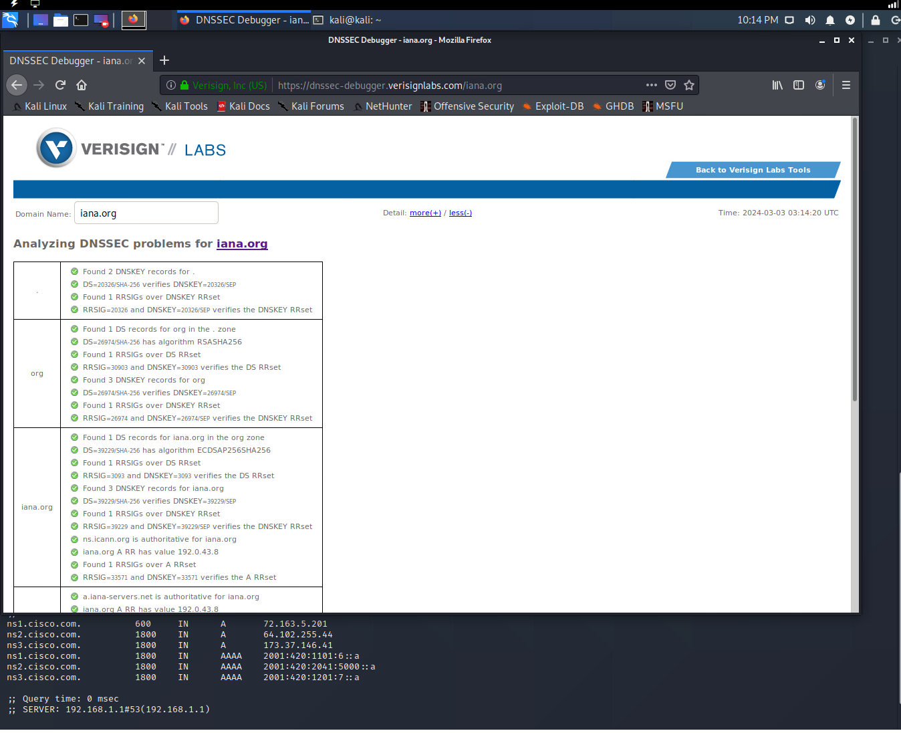
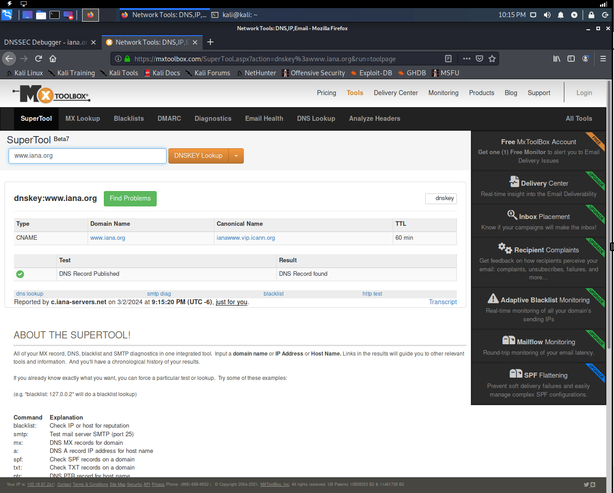

# digdnssec
dnssec, spf record, iana, cisco, verisignlabs, mxtoolbox

## Objective
To add DNS integrity check, spam control by leveraging DNSSEC, SPF & txt records.

## Domain Name System Security Extension

